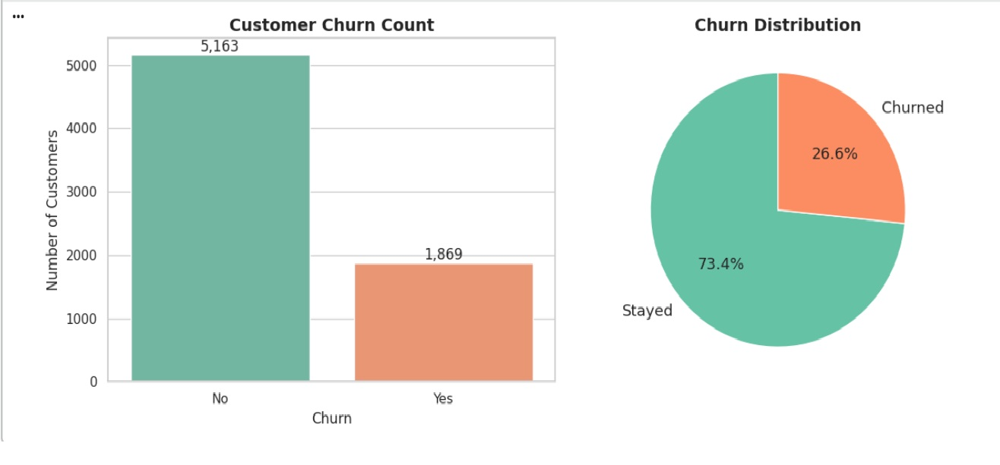
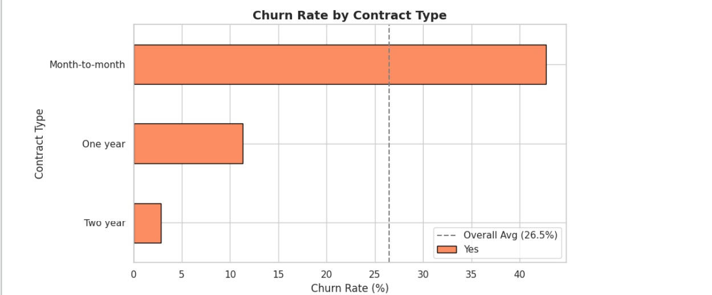
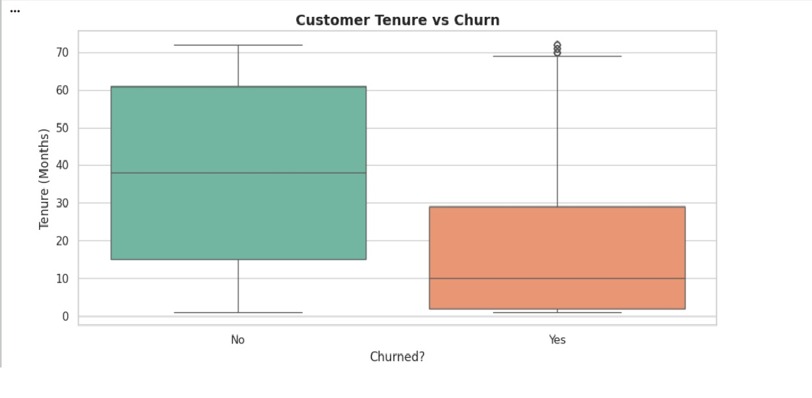
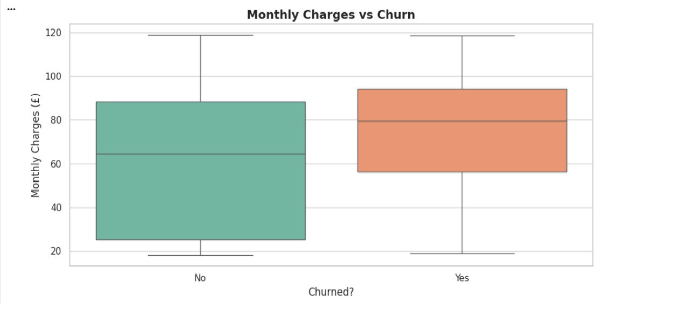
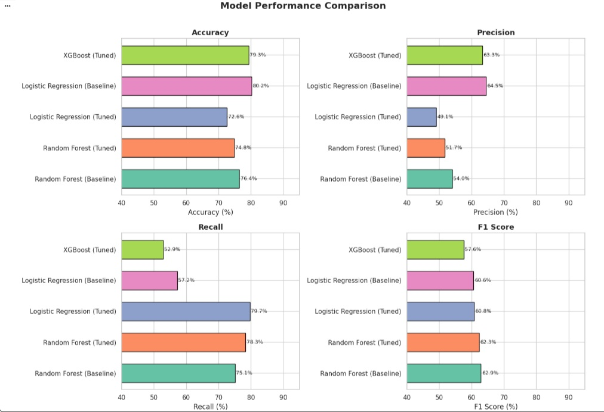
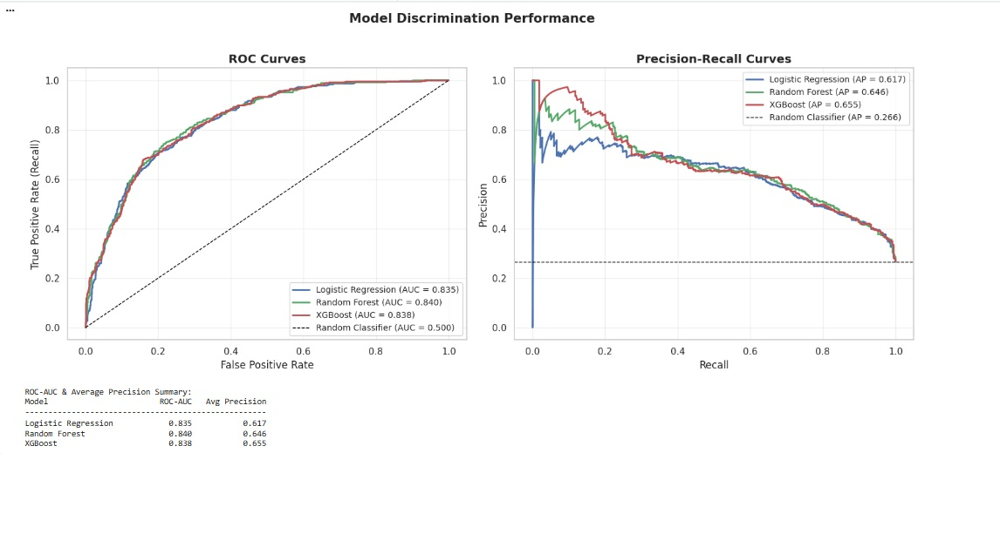

# Customer Churn Prediction using Supervised Machine Learning

## Predicting Customer Attrition with Explainable Machine Learning Models

A complete end-to-end machine learning project focused on predicting telecom customer churn using classification models, business-driven evaluation metrics, threshold optimisation, and explainability techniques.

This project demonstrates how machine learning can help organisations proactively identify customers at risk of leaving and take retention action before revenue is lost.

---

## Project Objective

Customer churn is one of the most expensive problems for subscription-based businesses. Acquiring a new customer often costs far more than retaining an existing one.

The objective of this project was to build predictive models that can:

- Identify customers likely to churn
- Compare multiple supervised learning algorithms
- Optimise decision thresholds based on business goals
- Explain predictions using SHAP values
- Generate actionable retention recommendations

---

## Why This Project Matters

This project demonstrates practical industry skills:

- End-to-end machine learning workflow
- Business problem framing
- Data cleaning and preprocessing
- Exploratory data analysis
- Model comparison and tuning
- Evaluation for imbalanced classification
- Explainable AI with SHAP
- Translating analytics into business action

---

## Dataset

**Telco Customer Churn Dataset**

- 7,043 customer records
- 21 original variables
- Reduced to **7,032 valid rows** after data cleaning
- Binary target variable: `Churn`

### Example Features

- Contract Type
- Tenure
- Monthly Charges
- Total Charges
- Internet Service
- Payment Method
- Senior Citizen
- Dependents
- Paperless Billing

---

## Tech Stack

- Python
- Pandas
- NumPy
- Matplotlib
- Seaborn
- Scikit-learn
- XGBoost
- SHAP
- Google Colab

---

## Data Cleaning & Preparation

Key preprocessing steps:

- Converted malformed `TotalCharges` values to numeric
- Removed 11 invalid rows
- Checked duplicates
- One-hot encoded categorical variables
- Train/test split using stratification
- Preserved churn ratio across train and test sets

Final modelling dataset:

- **7,032 rows**
- **31 columns after encoding**

---

# Exploratory Data Analysis

## Churn Distribution

- 26.6% customers churned
- Moderately imbalanced dataset
- Accuracy alone is not sufficient

---

## Churn by Contract Type

### Key Finding

- Month-to-month churn: **42.7%**
- One-year churn: **11.3%**
- Two-year churn: **2.8%**

Contract type was one of the strongest churn signals.

---

## Tenure vs Churn

### Key Finding

Churned customers had median tenure of ~10 months vs ~38 months for retained customers.

The first year is the highest-risk period.

---

## Monthly Charges vs Churn

### Key Finding

Customers who churned paid materially higher monthly charges.

This suggests price sensitivity or perceived value issues.

---

# Models Evaluated

The following supervised learning models were tested:

- Logistic Regression
- Random Forest
- XGBoost

Both baseline and tuned versions were evaluated.

Primary metric:

- **F1 Score** (best balance for churn problems)

Secondary metrics:

- Accuracy
- Precision
- Recall
- ROC-AUC
- Average Precision

---

# Final Model Performance

| Rank | Model | Accuracy | Precision | Recall | F1 Score |
|------|-------|----------|-----------|--------|----------|
| 1 | Random Forest (Baseline) | 76.4% | 54.0% | 75.1% | **62.9%** |
| 2 | Random Forest (Tuned) | 74.8% | 51.7% | 78.3% | 62.3% |
| 3 | Logistic Regression (Tuned) | 72.6% | 49.1% | **79.7%** | 60.8% |
| 4 | Logistic Regression (Baseline) | **80.2%** | **64.5%** | 57.2% | 60.6% |
| 5 | XGBoost (Tuned) | 79.3% | 63.3% | 52.9% | 57.6% |

---

# ROC-AUC & Precision Recall Analysis

| Model | ROC-AUC | Avg Precision |
|------|---------|---------------|
| Logistic Regression | 0.835 | 0.617 |
| Random Forest | **0.840** | 0.646 |
| XGBoost | 0.838 | **0.655** |

### Insight

All three models showed strong discrimination ability.

Random Forest delivered the best balance of ranking ability and operational performance.

---

# Explainable AI with SHAP

SHAP values were used to interpret model decisions.

### Most Important Drivers of Churn

- Low tenure
- Month-to-month contracts
- High monthly charges
- Fibre optic internet customers
- Electronic check payment method

This makes predictions transparent and business-actionable.

---

# Business Recommendations

## Convert Month-to-Month Customers

Offer incentives for 1-year or 2-year contracts.

## Protect New Customers

Launch first-year retention journeys for months 1 to 12.

## Review High Monthly Bills

Target customers paying above £75/month.

## Investigate Fibre Optic Segment

Potential pricing or service dissatisfaction.

## Deploy Churn Scoring Monthly

Use model outputs to prioritise retention outreach.

---

# Key Machine Learning Lessons

- Accuracy can be misleading in imbalanced datasets
- Recall is critical when churners are costly to lose
- F1 Score provides better balance
- Simpler models can outperform complex models
- Threshold tuning matters as much as model choice
- Explainability is essential for trust and actionability

---

## Development Note

The coding workflow for this project was developed with AI assistance for productivity, debugging support, code refinement, and troubleshooting.

---

